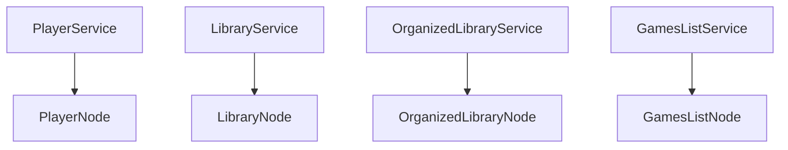

# Sgnome Architecture Documentation

## Overview

Sgnome is a gaming research tool that allows users to explore relationships between games, developers, and publishers through an interactive graph interface. The system is designed around a business-focused service architecture that answers questions rather than exposing rigid APIs.

## Core Design Principles

### 1. Domain-Focused Services
Services are organized by domain, providing domain-specific information about nodes:
- **PlayerService** - Provides player-centric information (profile, friends, activity)
- **LibraryService** - Provides library-centric information (collections, organization)
- **GamesService** - Provides game-centric information (details, recommendations, similar games)

**Key Principle**: **Services produce domain-specific data ABOUT a given node, in the form of Expandable or Inline pins**
As an example: The PlayerService provides Player related information for any type of node that Player's are relevant to.

### 2. Provider-Aggregator Pattern
Each service follows a consistent pattern:
```
Service/
├── Providers/           # Data source implementations
│   ├── SteamProvider    # Steam API integration
│   ├── EpicProvider     # Epic Games Store integration
│   └── RawgProvider     # RAWG database integration
├── Aggregator           # Combines pins from multiple providers
└── Service              # Thin wrapper exposing business methods
```

### 3. Graph-First Data Model
The system is designed around the concept of nodes and edges that can be visualized in a graph:
- **Nodes** represent entities (players, games, publishers)
- **Edges** represent relationships (owns, published-by, similar-to)
- **Pins** represent expandable or informational data on nodes

### 4. Uniform Pin-Based Communication
All service layers communicate using a uniform `Pin` format:
- **Providers** return `Pin` objects representing their data
- **Aggregators** combine and return `Pin` objects
- **Services** return `Pin` objects for their domain
- **Sgnome.Web** aggregates pins and builds `GraphResponse`

## Data Flow Architecture

### Frontend → Backend
1. User selects a node or searches for an entity
2. Frontend sends node data to backend with optional context
3. Backend resolves the node (GetOrCreate pattern)
4. Backend services analyze the node and generate pins
5. Backend returns a `GraphResponse` with nodes, edges, and pins

### Backend → Frontend
1. Sgnome.Web receives request and resolves target node
2. Services receive resolved node and identify relevant providers
3. Providers fetch data from external APIs and return pins
4. Aggregators combine pins from multiple providers
5. Services return organized pins for their domain
6. Sgnome.Web builds `GraphResponse` with nodes, edges, and aggregated pins

### Return Type Flow
```
Sgnome.Web API → GraphResponse
Service → Pins
Aggregator → Pins
Provider → Pins
```

## Graph Data Model

### Node Structure
```json
{
  "id": "player-76561198000000000",
  "type": "default",           // xyflow node type
  "x": 100, "y": 100,         // xyflow coordinates (frontend-managed)
  "data": {                   // Our custom data
    "label": "Alex",
    "nodeType": "player",     // Our node classification
    "properties": {},         // Serialized domain object
    "pins": [],              // Expandable relationships
    "state": "loaded"        // Loading state
  }
}
```

### Pin System
Pins represent expandable relationships or informational data:

#### Pin Structure
```json
{
  "id": "steam-library",
  "label": "Steam Library",
  "type": "library",
  "state": "unexpanded",
  "behavior": "expandable",
  "summary": {
    "displayText": "Owns 150 games on Steam",
    "count": 150,
    "icon": "library",
    "preview": {}
  },
  "metadata": {
    "targetNodeType": "library",
    "targetNodeId": null,
    "originNodeId": "player-76561198000000000",
    "apiEndpoint": "/api/player/library",
    "parameters": {
      "steamId": "76561198000000000"
    }
  }
}
```

#### Expandable Pins
- Can be clicked to create new nodes/edges
- Contain metadata for API expansion
- Example: "Recently Played (5 games)" → expands to game nodes

#### Informational Pins
- Display supplementary data inline
- No expansion capability
- Example: "Released: 2020-12-10"

### Edge Structure
```json
{
  "id": "edge-1",
  "source": "player-76561198000000000",
  "target": "game-730",
  "type": "default",          // xyflow edge type
  "data": {                   // Our custom data
    "label": "Owns",
    "edgeType": "owns",       // Our relationship classification
    "properties": {}          // Relationship metadata
  }
}
```

## Service Architecture

### Provider Pattern
Providers handle integration with external data sources and return uniform pin format:

```csharp
public interface ISteamUserLibraryProvider
{
    Task<IEnumerable<Pin>> GetUserLibraryPinsAsync(string steamId);
    Task<IEnumerable<Pin>> GetRecentlyPlayedPinsAsync(string steamId);
}
```

### Aggregator Pattern
Aggregators combine pins from multiple providers:

```csharp
public class UserLibraryAggregator
{
    private readonly ISteamUserLibraryProvider _steamProvider;
    private readonly IEpicUserLibraryProvider _epicProvider;
    
    public async Task<IEnumerable<Pin>> GetUserLibraryPinsAsync(PlayerNode player)
    {
        var pins = new List<Pin>();
        
        // Collect pins from multiple providers
        if (!string.IsNullOrEmpty(player.SteamId))
        {
            var steamPins = await _steamProvider.GetUserLibraryPinsAsync(player.SteamId);
            pins.AddRange(steamPins);
        }
        
        // Combine and deduplicate pins
        return pins;
    }
}
```

### Service Layer
Services provide domain-focused APIs that return pins:

```csharp
public interface IPlayerService
{
    Task<IEnumerable<Pin>> GetPlayerInfoPinsAsync(PlayerNode player);
    Task<IEnumerable<Pin>> GetFriendsPinsAsync(PlayerNode player);
    Task<IEnumerable<Pin>> GetActivityPinsAsync(PlayerNode player);
}

public interface ILibraryService
{
    Task<IEnumerable<Pin>> GetLibraryPinsAsync(PlayerNode player);
    Task<IEnumerable<Pin>> GetOrganizedLibraryPinsAsync(string librarySource, string playerId);
}
```

## Node Resolution and Context Management

### NodeResolver Pattern
Sgnome.Web includes a NodeResolver that handles node persistence and resolution:

```csharp
public interface INodeResolver
{
    Task<Node> ResolvePlayerNodeAsync(PlayerNode player);
    Task<Node> ResolveGameNodeAsync(GameNode game);
    Task<Node> GetOrCreateNodeAsync<T>(T nodeData) where T : class;
}
```

### Context-Driven Edge Generation
Edges are generated based on frontend-provided context:

#### Single Node Operations (No Edges)
```
POST /api/player/select
Body: { steamId: "123", displayName: "Alex" }
Response: { nodes: [playerNode], edges: [], pins: [...] }
```

#### Pin Expansion with Context (Creates Edges)
```
POST /api/library/select  
Body: { 
  libraryId: "steam-123", 
  originNodeId: "player-123",  // Context for edge creation
  targetNodeType: "library"
}
Response: { nodes: [libraryNode], edges: [player->library], pins: [...] }
```

#### Bulk Operations (Multiple Edges)
```
POST /api/games/bulk-select
Body: { 
  gameIds: ["730", "440", "570"], 
  createEdges: true,
  edgeType: "similar-to"
}
Response: { nodes: [gameNodes], edges: [similarEdges], pins: [...] }
```

## Pin Generation Strategy

### Pin Types
1. **Relationship Pins** - Connect to other entities (publisher, similar games)
2. **Collection Pins** - Expand to lists (recently played, owned games)
3. **Analytics Pins** - Show computed data (favorite genres, playtime stats)
4. **Informational Pins** - Display facts (release date, player count)

### Pin Metadata
Each expandable pin contains:
- **Target Node Type** - What type of node will be created
- **Target Node ID** - If we know the specific node
- **Origin Node ID** - The source node that owns this pin
- **API Endpoint** - Where to fetch the expansion data
- **Parameters** - Additional context for the API call

### Response Metadata
Each `GraphResponse` includes metadata for state management:

```json
{
  "metadata": {
    "operationId": "user-library-76561198000000000",
    "operationType": "GetUserLibrary",
    "sourceNodeId": "player-76561198000000000",
    "timestamp": "2024-01-15T10:30:00Z",
    "provider": "Steam",
    "expandedPins": ["recently-played", "owned-games"],
    "nodeCount": 15,
    "edgeCount": 12
  }
}
```

#### Metadata Fields
- **operationId** - Unique identifier for this specific operation
- **operationType** - The service method that was called
- **sourceNodeId** - The node that triggered this response
- **timestamp** - When the data was generated
- **provider** - Primary data source used
- **expandedPins** - Which pins were expanded in this response
- **nodeCount/edgeCount** - For debugging and optimization

## Frontend Integration

### xyflow Compatibility
The system is designed to work seamlessly with xyflow:
- Nodes and edges follow xyflow's expected structure
- Custom data is stored in the `data` field
- Frontend can directly pass nodes/edges to xyflow

### Pin Interaction
1. User clicks an expandable pin
2. Frontend extracts API endpoint and context from pin metadata
3. Frontend makes API call with origin node context
4. Backend returns new nodes/edges with metadata
5. Frontend merges response into existing graph state
6. Frontend updates xyflow with merged state

### Graph State Management
The frontend is responsible for maintaining a unified graph state:

#### Responsibilities
- **State Aggregation** - Merge multiple API responses into single graph
- **Duplicate Prevention** - Use node/edge IDs to prevent duplicates
- **Conflict Resolution** - Use metadata timestamps for precedence
- **Pin State Tracking** - Track which pins have been expanded
- **Loading States** - Show loading indicators during API calls

#### Implementation Considerations
- **Memory Management** - Limit graph size, implement cleanup strategies
- **Performance** - Efficient merging algorithms for large graphs
- **User Experience** - Smooth transitions, loading states, error handling
- **Debugging** - Log metadata for troubleshooting

### State Management
- **Node State** - Tracks loading/loaded/error states
- **Pin State** - Tracks unexpanded/loading/expanded states
- **Graph Context** - Maintains query history and context

### Graph State Aggregation
The frontend maintains a unified graph state that gets incrementally updated:

#### Metadata-Driven Updates
- Each `GraphResponse` includes metadata identifying the source operation
- Frontend uses metadata to determine how to merge new data with existing state
- Prevents duplicate nodes/edges while preserving existing relationships

#### State Aggregation Logic
```typescript
interface GraphState {
  nodes: Map<string, Node>;           // Keyed by node ID
  edges: Map<string, Edge>;           // Keyed by edge ID
  metadata: Map<string, ResponseMetadata>; // Track response sources
}

function mergeGraphResponse(
  currentState: GraphState, 
  response: GraphResponse
): GraphState {
  // Merge nodes (preserve existing, add new, update if newer)
  // Merge edges (prevent duplicates, update if newer)
  // Track metadata for debugging/optimization
  // Handle conflicts based on metadata timestamps
}
```

#### Update Strategies
1. **Node Updates** - Merge properties, preserve existing pins, add new pins
2. **Edge Updates** - Prevent duplicates, update properties if newer
3. **Pin Expansion** - Replace pin with expanded nodes/edges, update source node
4. **Conflict Resolution** - Use metadata timestamps to determine precedence

## Extensibility

### Adding New Node Types
1. Create domain class (e.g., `DeveloperNode`)
2. Add to `NodeBuilder` for xyflow conversion
3. Create corresponding service and providers
4. Update pin generation logic

### Adding New Data Sources
1. Create provider interface and implementation that returns `Pin` objects
2. Add provider to aggregator
3. Update pin generation to use new data
4. No changes needed to existing services

### Adding New Pin Types
1. Define pin behavior (expandable/informational)
2. Create pin generation logic in aggregators
3. Update frontend to handle new pin types
4. Add API endpoints for expansion

## Performance Considerations

### Caching Strategy
- **Node Data** - Cache by node ID and type
- **Pin Data** - Cache by pin type and context
- **Provider Data** - Cache external API responses
- **Graph Context** - Cache query results

### Lazy Loading
- Nodes load with minimal data initially
- Pins provide preview information
- Full data loads only when pins are expanded
- Progressive disclosure reduces initial load time

### Streaming Support
- HTTP/2 server-sent events for real-time updates
- Progressive pin population
- Live data updates (player counts, etc.)

## Security Considerations

### API Key Management
- Provider API keys stored securely
- No keys exposed to frontend
- Rate limiting per provider
- Key rotation support

### Data Privacy
- User consent for data access
- Minimal data collection
- Secure data transmission
- GDPR compliance considerations 

## Domain Service Pattern: One Node, One Domain, One Service

### Principle

**Each node type in the graph is owned by a single domain service.**  
- Each service is responsible for:
  - Node resolution (creating, fetching, or reconstructing nodes of its type)
  - Generating pins relevant to its node type
  - Aggregating data from providers for its node type

**No service creates or resolves nodes outside its domain.**  
- Services may provide data (via pins) to other nodes, but never create or resolve those nodes directly.

---

*is this over engineering? Perhaps. But we choose this pattern because it is enforceable*

### Pattern Structure



- **PlayerService**: Owns `PlayerNode`
- **LibraryService**: Owns `LibraryNode`
- **OrganizedLibraryService**: Owns `OrganizedLibraryNode`
- **GamesListService**: Owns `GamesListNode`
- (etc.)

---

### Responsibilities

- **Node Resolution**:  
  Each service exposes a `ResolveNodeAsync(Partial<NodeType>)` method to resolve or create its node type from partial data.

- **Pin Generation**:  
  Each service generates pins relevant to its node type, aggregating from providers as needed. This includes generating pins about itself (building out content, informational pins) AND providing links from a foreign domain to it's domain (expandable pins). It's valid to call PlayerService.GeneratePins(LibraryNode library), with the expectation that the service provides pins linking the given LibraryNode to PlayerNodes. 

- **Domain Services always generate pins targeting a Node of its own Domain**

- **No Cross-Domain Node Creation**:  
  Services never create or resolve nodes outside their domain.  
  (e.g., PlayerService never creates a LibraryNode.)


---

### Benefits

- **Separation of Concerns**: Each service is focused and testable.
- **Extensibility**: New node types = new services, no impact on existing code.
- **Clear Ownership**: Easy to reason about where logic for a node type lives.
- **Scalable Caching**: Each service can implement its own caching strategy.
- **No Circular Dependencies**: Services communicate via pins, not direct node creation.

---

### Example

```csharp
// PlayerService.cs
public Task<PlayerNode> ResolveNodeAsync(PlayerNode partial);

// LibraryService.cs
public Task<LibraryNode> ResolveNodeAsync(LibraryNode partial);

// OrganizedLibraryService.cs
public Task<OrganizedLibraryNode> ResolveNodeAsync(OrganizedLibraryNode partial);
```

---

### Controller Orchestration

Controllers are responsible for:
- Calling the appropriate service to resolve a node
- Calling services to generate pins for that node
- Building the graph response

---

**Summary:**  
> “One Node, One Domain, One Service” is the enforceable pattern for Sgnome’s backend.  
> Each node type is owned, resolved, and managed by a single domain service. 